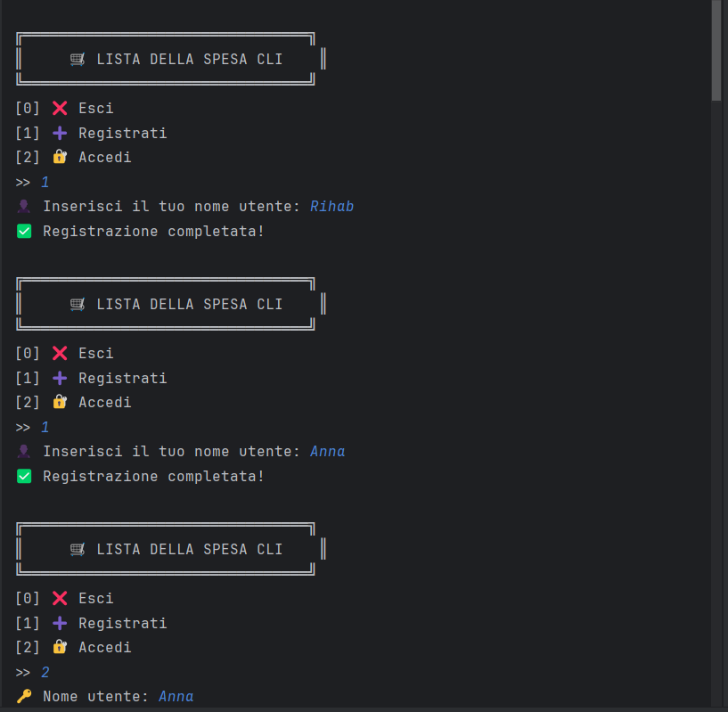
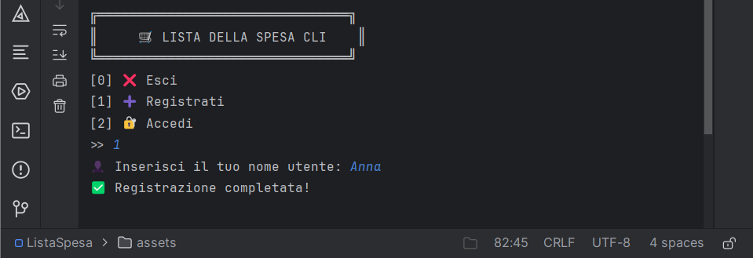
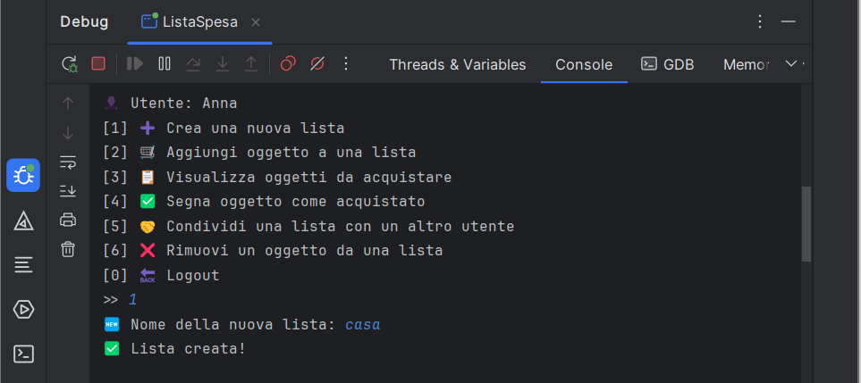
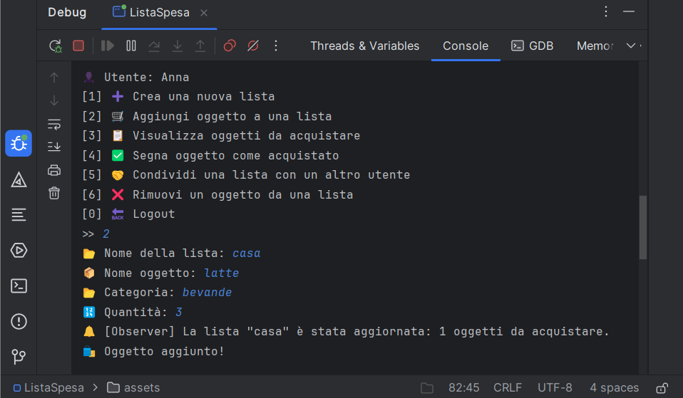
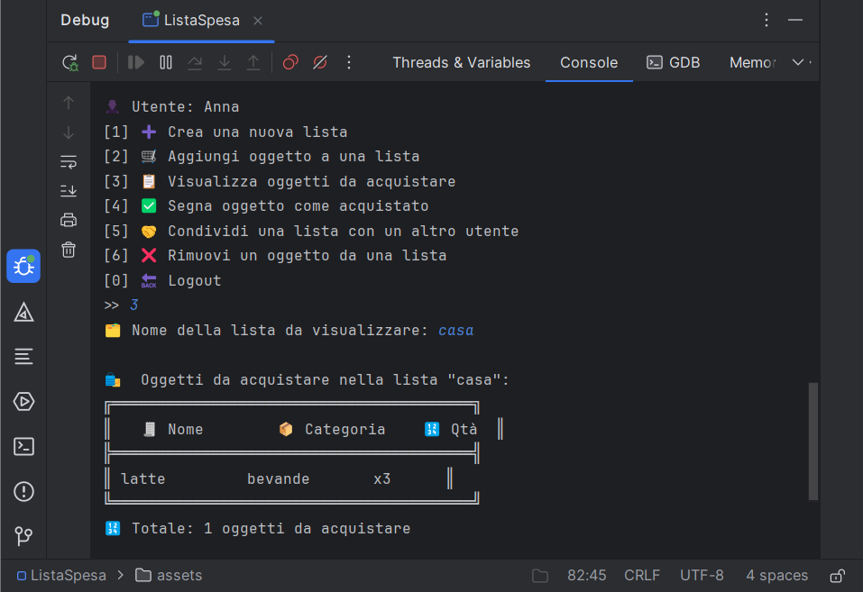
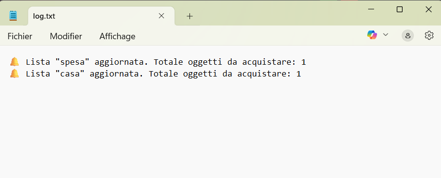

# 🛒 # 🛒 Progetto di Laboratorio di Programmazione in C++
## Lista della Spesa (Stile Listonic

Benvenuti nel progetto Lista della Spesa, una semplice applicazione da terminale scritta in C++ che ti permette di:
    -  👥  Creare e gestire liste della spesa
     - 📋 Aggiungere/rimuovere oggetti
     - 🛍️ Segnare oggetti come acquistati
     - 🔄 Condividere liste con altri utenti
    - 🔔 Ricevere notifiche automatiche tramite il pattern Observer

## 📌 Descrizione del Progetto

Questo progetto implementa una **gestione di liste della spesa multi-utente**, ispirata a sistemi come Listonic.  
Ogni utente può creare, gestire e condividere liste della spesa contenenti oggetti appartenenti a diverse categorie con quantità specificate.

Inoltre, grazie all'implementazione del **design pattern Observer**, è possibile **ricevere notifiche automatiche** ogni volta che una lista viene modificata.


## 📁 Struttura del progetto

      ChatGPT a dit :
Perfetto Rihab! 😊 Grazie per lo screenshot, adesso ti riscrivo una versione più pulita e ordinata della sezione "Struttura del progetto", adatta per il tuo README.

✅ Nuova sezione "📁 Struttura del progetto" (formale e chiara)
markdown
Copier le code
## 📁 Struttura del progetto

Il progetto è organizzato nelle seguenti cartelle:

                    ListaSpesa/
                    ├── assets/ # 📸 Screenshot del progetto
                    │ ├── 1.png
                    │ ├── 2.png
                    │ ├── 3.png
                    │ ├── 4.png
                    │ ├── 5.png
                    │ └── 6.png
                    ├── build/ # 🏗️ Cartella di build generata da CMake
                    ├── cmake-build-debug/ # 🛠️ Build folder (da CLion o CMake)
                    ├── src/ # 🧠 Codice sorgente
                    │ ├── main.cpp
                    │ ├── Item.cpp / Item.h
                    │ ├── ShoppingList.cpp / ShoppingList.h
                    │ ├── User.cpp / User.h
                    │ ├── ConsoleObserver.cpp / ConsoleObserver.h
                    │ ├── FileObserver.cpp / FileObserver.h
                    │ └── Observer.h
                    ├── tests/ # 🧪 Test automatici (Google Test)
                    │ ├── test_item.cpp
                    │ ├── test_shoppinglist.cpp
                    │ └── test_user.cpp
                    ├── .gitignore # 🚫 File di esclusione Git
                    ├── CMakeLists.txt # ⚙️ Configurazione del progetto CMake
                    └── README.md # 📘 Documentazione del progetto

## 🧱 Architettura e Struttura delle Classi

- Item : Rappresenta un singolo oggetto della spesa (nome, categoria, quantità, stato di acquisto).
- ShoppingList: Contiene una lista di `Item` e gestisce gli observer.
- User : Gestisce le liste dell’utente e la condivisione con altri utenti.
- Observer (Interfaccia Astratta): Definisce il metodo di notifica.
- ConsoleObserver: Implementazione che stampa le notifiche sulla console.
- FileObserver: Implementazione che registra le notifiche su file di log.

## ✨ Funzionalità principali

-   ✅  Registrazione e login utenti
-   🛒  Creazione e modifica di liste della spesa
-   📦 Aggiunta, rimozione e gestione oggetti (nome, categoria, quantità)
-   ✅ Segnalazione di oggetti acquistati
-   🔔 Notifica  con Observer :
                * ConsoleObserver : Messaggi sulla console.
                * FileObserver : Log automatico delle modifiche su file ('log.txt').
-   🤝 Condivisione liste tra utenti
-   📋 Visualizzazione tabellare degli oggetti da acquistare
-  🧪 Test unitari con Google Test

## 🧰 Design Pattern utilizzati

- Observer Pattern : Per notificare automaticamente tutte le interfacce utente (console o file) quando una lista viene modificata.

## 🧪 Unit Testing

Il progetto include una suite di **test unitari** sviluppati con **Google Test**.  
I test coprono le seguenti classi principali:

- ✅ `Item`
- ✅ `ShoppingList`
- ✅ `User`

I test sono eseguibili con il comando:

```bash
./UnitTests

## 🖼️ Screenshot (Esempi di Esecuzione)

            ✅ Menu Principale
            
            
            ✅ Registrazione di un nuovo utente
            
            
            ✅ Creazione di una nuova lista
            
             
            ✅ Aggiunta di un oggetto e notifica Observer
            
              
            ✅ Visualizzazione oggetti da acquistare
            
               
            ✅ Contenuto del file log.txt (Observer su file)
             


## 🔧 Strumenti utilizzati
      -Linguaggio: C++17
      -Build System: CMake
      -Unit Testing Framework: Google Test
      -Controllo Versione: Git (repository GitHub)
      -IDE: CLion (JetBrains)

## 👩‍💻  Autrice

     Rihab Sagaama
     Studentessa del Corso di Laurea in Ingegneria Informatica
     Università degli Studi di Firenze
     GitHub: @SagaamaRihab

